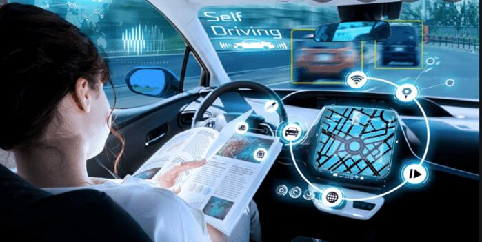

## Applications of AI
AI can be used in almost every industry you an think of. For example, the healthcare industry -- AI can be used for treatments, as well as assisting in a surgical procedure. AI has also been used for self-driving cars, detecting fraud. The opprotunities with AI are endless, and as it develops, the more it is capable of.

| [Home](https://github.com/caelenwalker/MarkdownChallenge) | [Understanding AI](https://github.com/caelenwalker/MarkdownChallenge/blob/main/understanding.md) | [Types of AI](https://github.com/caelenwalker/MarkdownChallenge/blob/main/types.md) |

-------------------------------------------------
> “Google is working on self-driving cars, and they seem to work.  People are so bad at driving cars that computers don’t have to be that good to be much better.”

