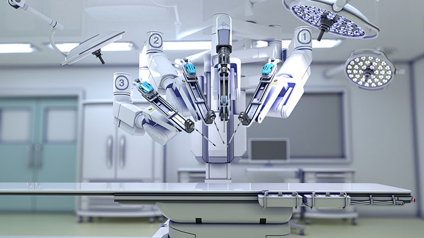

## Understanding AI
Typically, when people hear AI, the first thing they think of is robots. But really, AI is focused on computers and programming. AI's main focus is to easily mimic humans and execute tasks. These tasks can range from drawing a circle, to driving a car. Researchers are constantly making progress in AI. Some people believe that researchers will be able to create AI that surpasses the human mind. The goal is to create AI technology to benefit everyday life, across many different fields. For example, we might see AI in hospitals, airports, or restaurants. 

| [Home](https://github.com/caelenwalker/MarkdownChallenge) | [Types of AI](https://github.com/caelenwalker/MarkdownChallenge/blob/main/types.md) | [Applications of AI](https://github.com/caelenwalker/MarkdownChallenge/blob/main/applications.md) |

---------------------------------------------------

> “The promise of artificial intelligence in medicine is to provide composite, panoramic views of individuals' medical data; to improve decision making; to avoid errors such as misdiagnosis and unnecessary procedures; to help in the ordering and interpretation of appropriate tests; and to recommend treatment.”

